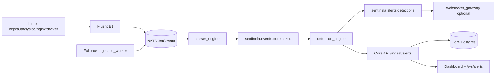

# SENTINELA Distributed Architecture

The SENTINELA is split into a resilient core and event-driven auxiliary services.

## Core Node

The current `SENTINELA-AMD-TEST` remains the core node:

- dashboard web
- dashboard API
- JWT/RBAC/auth
- Redis core
- Postgres core
- `/ws/alerts` realtime feed

The core must pass `./ops/oci/dr_check.sh` before and after pipeline changes.

## Event Bus Node

NATS JetStream is the default event bus for Oracle Free Tier because it is light and resilient. Redpanda/Kafka can be added later when capacity exists.

Subjects:

- `sentinela.logs.raw`
- `sentinela.events.normalized`
- `sentinela.alerts.detections`
- `sentinela.events.dlq`

## Ingestion Node

Fluent Bit tails:

- `/var/log/auth.log`
- `/var/log/syslog` or `/var/log/messages`
- `/var/log/nginx/access.log`
- `/var/log/nginx/error.log`
- Docker JSON logs under `/var/lib/docker/containers`
- selected systemd units for ssh/sudo

`ingestion_worker` is a fallback tailer for minimal hosts where Fluent Bit output plugins are constrained.

## Hunting and Graph Nodes

OpenSearch and Neo4j are intentionally not part of this rollout. They should be deployed as separate future nodes after event streaming is stable.

